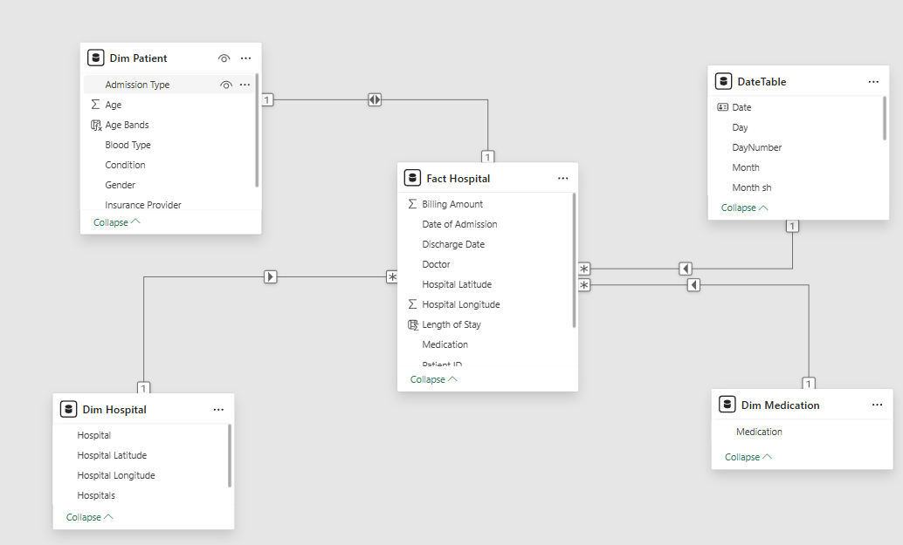

# Healthcare Analysis Dashboard
This project details the development and analysis of an interactive Power BI dashboard focusing on patient admission, billing, and demographics data from various hospitals and insurance providers across the United States. The dataset, covering 2019 to 2024, was cleaned, transformed, and aggregated to track key performance indicators such as total patient admissions, total billing amount, average length of stay, and the most common medical condition. The dashboard aims to provide healthcare administrators, financial analysts, and operational managers with comprehensive insights to optimise resource allocation, identify financial trends, and improve patient care strategies.

Insights and recommendations are provided on the following key areas:

* Category 1: Patient Volume & Demographics
* Category 2: Billing & Financial Performance
* Category 3: Treatment & Condition Insights
* Category 4: Provider Trends

The dataset was cleaned, aggregated, and analysed using Power Query and DAX formulas before being visualised in Power BI across three pages — Overview, Demographics, and Insights — creating a clean, modern, and fully navigable user interface.

[📊 Power BI Dashboard Link]()

## Dataset Description
The data model comprises five tables capturing patient admissions, billing records, and demographic information from various hospitals and insurance providers across the United States, designed in a star schema. This structure efficiently supports the analysis of key performance indicators over the specified period.

### Tables
* Fact Hospital: The central fact table containing granular details of each patient admission, including Billing Amount, Date of Admission, Discharge Date, Doctor, Length of Stay, and Hospital Latitude and Longitude for geographic analysis. Patient ID is used for unique patient tracking.
* Dim Patient: A dimension table providing detailed patient demographics and admission characteristics such as Admission Type, Age, Age Bands, Blood Type, Medical Condition, Gender, and Insurance Provider.
* Dim Hospital: A dimension table containing unique hospital names and additional hospital-specific attributes.
* Dim Medication: A dimension table listing distinct medication types prescribed during admissions.
* DateTable: A standard date dimension table used for time-based filtering and analysis, including Date, Day, Month, Quarter, and Year columns, with a short month name (Month sh) for display purposes.

### Calculated Measures
* Total Patients: Count of unique patient admissions derived from Patient ID in Fact Hospital.
* Total Billing Amount: Sum of all billing amounts from Fact Hospital.
* Avg Length of Stay: Average length of stay calculated from admission and discharge dates.
* Most Common Condition: Dynamically identifies the most frequent medical condition from Dim Patient.
* % YoY Growth: Year-over-Year percentage change for Total Patients and Total Billing Amount.
* Additional DAX measures for breakdowns by gender, age band, condition, insurance provider, and hospital.

### Field Parameter
A dynamic field parameter was created to allow users to toggle the time axis across visuals between Month, Quarter, and Year — enabling flexible time-based analysis without duplicating charts. This was built using NAMEOF() references to the DateTable columns:

Parameter = {
    ("M", NAMEOF('DateTable'[Month sh]), 0, "Admitted Patients By Month"),
    ("Q", NAMEOF('DateTable'[Quarter]), 1, "Admitted Patients By Quarter"),
    ("Y", NAMEOF('DateTable'[Year]), 2, "Admitted Patients By Year")
}

## Executive Summary

### Overview of Findings
Between 2019 and 2024, the analysed healthcare system experienced consistent growth in patient volume and billing revenue. While the average length of stay remained stable, key insights emerged regarding the prevalence of chronic conditions, financial contributions of major providers and insurers, and demographic patterns across the hospital network.

* A total of **55,500 patients** were served, generating **$1.42 billion** in total billing, both showing a healthy **7% Year-over-Year (YoY)** increase.
* The **average length of stay** remained consistent at **15.51 days, with 0% YoY change.**
* **Hypertension** was identified as the **most common medical condition across all admissions.**
* Billing remained relatively stable between **2020 and 2023, ranging from $280.16M to $286.55M annually, growing from $189.85M in 2019.**
* **Houston Methodist Hospital** led the network in both patient volume (20.4K) and billing contribution.

### Insights Deep Dive

**Category 1: Patient Volume & Demographics**
* **Total Patient Volume:** The dashboard tracked 55,500 patient admissions over the period, demonstrating a 7% YoY increase, indicating expanding service reach or rising healthcare demand.
* **Gender Distribution:** Admissions were split across Female (40%, 22K), Male (50%, 28K), and Non-binary (10%, 6K) patients, highlighting the importance of inclusive demographic data capture across the hospital network.
* **Admitted Patients Trend:** The line chart on the Overview page, powered by the dynamic M/Q/Y field parameter toggle, shows patient admissions growing from approximately 7K in 2019 to a peak of ~11K in 2020, remaining stable through 2023, before declining to ~4K in 2024 — consistent with partial year data.
* **Hospital Patient Volume:** Houston Methodist Hospital recorded the highest patient volume at 20.4K, followed by Johns Hopkins Hospital (11.3K) and UCLA Medical Centre (6.9K). Northwestern Medicine, Massachusetts General, UCSF Medical Centre, and Cleveland Clinic each saw approximately 2.4K–2.5K admissions.
* **Condition by Hospital Matrix:** The Overview matrix highlights that Houston Methodist Hospital managed the highest patient counts across all conditions — most notably Diabetes (5,104), Hypertension (5,057), and Obesity (4,714). Johns Hopkins followed with 2,813 Diabetes and 2,786 Hypertension patients.

**Category 2: Billing & Financial Performance**
* **Total Billing:** A substantial $1.42 billion was billed across all services, reflecting a 7% YoY increase in line with rising patient volumes.
* **Total Billing Amount by Year:** Billing grew from $189.85M in 2019 to a peak of $286.55M in 2020, remaining broadly stable from 2021 ($280.16M) through 2023 ($281.98M), before declining to $97.82M in 2024, reflecting a partial year of data. The average line sits at $236.24M, providing a useful benchmark across the full period. Drill-down functionality allows users to explore billing trends at the Quarter and Month level.
* **Billing by Medical Condition:**  Billing by Medical Condition: Hypertension and Diabetes generated the highest billing amounts (both approaching approximately $350M over the period), followed by Obesity ($320M). Cancer ($140M), Arthritis ($140M), and Asthma ($110M) contributed the lower shares, reflecting their smaller patient volumes.
* **Billing by Insurance Provider:** Medicare was the dominant insurance provider by total billing at $707.47M, followed by UnitedHealthCare ($426.05M), Cigna ($142.79M), and Aetna ($141.12M). The treemap visual makes these proportional differences immediately clear.

image

**Category 3: Treatment & Condition Insights**
* **Condition-Medication Matrix:** The Insights page matrix breaks down medication usage by condition across five medications — Aspirin, Ibuprofen, Lipitor, Paracetamol, and Penicillin. Hypertension and Diabetes patients recorded the highest medication counts overall, with Hypertension patients receiving Penicillin most frequently (2,892) and Diabetes patients receiving Ibuprofen and Lipitor at similar rates (~2,858–2,861). Medication usage was broadly even across all five drugs for each condition, suggesting no single dominant treatment protocol.
* **Condition Prevalence:** Across all admissions, Hypertension and Diabetes were the most prevalent conditions (13,875 each), followed by Obesity (12,765), Cancer (5,550), Arthritis (5,550), and Asthma (3,885).
  

**Category 4: Provider Trends**
* **Patients by Insurance Provider**: In 2021, Medicare accounted for the largest share of patients at 49.89% (~5K), followed by Aetna (30.08%, ~3K), UnitedHealthCare (10.27%, ~1K), and Cigna (9.76%, ~1K). This pattern highlights Medicare's dominant role in funding patient care across the network.
* **Patients by Age Group:** The Demographics page bar chart shows patient volumes are broadly distributed across age groups from 20–79, with the 30–39 bracket recording the highest volume (1,676 in 2021), closely followed by 70–79 (1,635), 50–59 (1,632), and 20–29 (1,545). The 13–19 age group recorded the lowest volume (320), and the 80–89 group recorded 944 admissions.
* **Patients by Admission Type and Gender:** The clustered bar chart on the Demographics page shows admissions were evenly spread across Elective (Female: 1,897, Male: 1,467, Non-binary: 364), Emergency (Female: 1,760, Male: 1,430, Non-binary: 379), and Urgent (Female: 1,796, Male: 1,458, Non-binary: 380) admission types, with Female patients consistently the highest across all three categories. A field parameter toggle allows users to switch the same chart between Admission Type, Condition, and Age breakdowns.

## Recommendations

Based on the insights surfaced in this dashboard, the following recommendations are put forth:

* **Targeted Outreach for High-Volume Conditions:** Develop specific public health programmes, preventative care initiatives, and resource allocation strategies for Hypertension and Diabetes, which together account for 50% of all admissions and the highest share of total billing.
* **Resource Optimisation for Key Hospitals:** Prioritise staffing, funding, and infrastructure investment for Houston Methodist Hospital and Johns Hopkins, given their disproportionately high patient volumes and condition loads across all six medical conditions.
* **Seasonal & Quarterly Staffing Adjustments:** Leverage the M/Q/Y field parameter analysis to identify peak admission periods and implement flexible staffing models accordingly, ensuring capacity is in place during high-demand months and quarters.
* **Insurance Partnership Strategy:** With Medicare accounting for nearly 50% of patients and $707.47M in billing, optimising billing cycles and strengthening relationships with Medicare should be a strategic priority. Opportunities also exist to grow partnerships with UnitedHealthCare.
* **Medication Formulary Review:** The even distribution of medication usage across Aspirin, Ibuprofen, Lipitor, Paracetamol, and Penicillin for high-volume conditions suggests an opportunity to review formulary effectiveness and cost-efficiency, particularly for Hypertension and Diabetes patients.
* **Admission Type Planning:** The near-equal split across Elective, Emergency, and Urgent admissions suggests demand is not concentrated in one admission category. Hospitals should ensure capacity planning accounts for all three types simultaneously rather than prioritising one over others.

## Assumptions

* Data completeness and accuracy from the source hospital and insurance provider systems are assumed following the cleaning and transformation process in Power Query.
* All KPIs and measures are calculated based solely on the provided dataset without external imputation.
* The decline in 2024 figures (billing: $97.82M, patients: ~4K) reflects a partial year of data rather than an actual reduction in hospital activity, as the dataset covers through May 2024 only.
* The classification of patient conditions, demographics, medication, and admission types is assumed to be consistent across all hospitals and data sources.
* Length of Stay is calculated as the difference between Discharge Date and Date of Admission and is assumed to be recorded accurately across all admissions.
* The Demographics page figures referenced in this document reflect a 2021 filtered view as shown in the dashboard screenshots; full period totals will differ.

## 14. Author

**[Your Name]**
[Your role or title - current or target]

- 🔗 [LinkedIn URL]
- 💼 [Portfolio or GitHub profile URL]
- 📧 [Email - optional]
